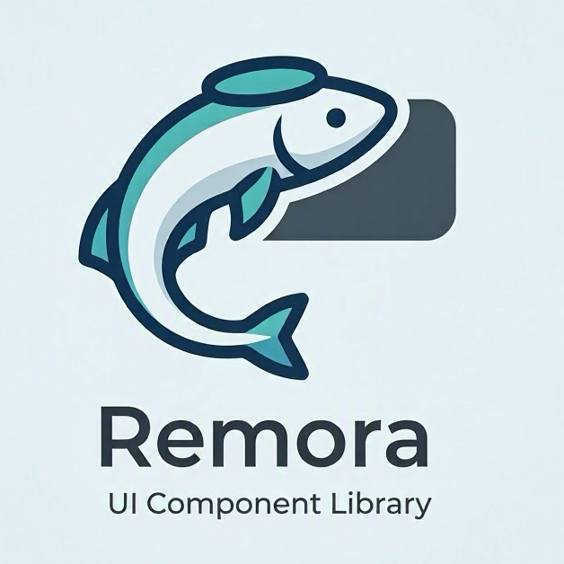

# Remora



## Overview

A platform-team owned component library of [Lit](https://lit.dev) web components, documented and developed in [Storybook](https://storybook.js.org). Components are framework-agnostic — they work in any app regardless of whether it uses React, Vue, Angular, or plain HTML.

---

## Table of Contents

- [Installation](#installation)
- [Usage](#usage)
- [Available Components](#available-components)
- [Does My App Need TypeScript?](#does-my-app-need-typescript)
- [Full Library or Single Component?](#full-library-or-single-component)
- [Theming and CSS Custom Properties](#theming-and-css-custom-properties)
- [Development — Adding Components](#development--adding-components)
- [Storybook](#storybook)
- [Building and Publishing](#building-and-publishing)

---

## Installation

### 1. Configure the GitLab npm registry

Point npm at the GitLab registry by adding a `.npmrc` file to the root of the consuming project:

```ini
//gitlab.yourcompany.com/api/v4/packages/npm/:_authToken=${GITLAB_NPM_TOKEN}
```

Set `GITLAB_NPM_TOKEN` as an environment variable or CI/CD secret — use a GitLab Project Access Token or Deploy Token with `read_package_registry` scope.

### 2. Install the package

```bash
npm install remora
```

> **Lit is a peer dependency.** If your app doesn't already use Lit, install it alongside:
> ```bash
> npm install remora lit
> ```
> Lit is tiny (~6 KB gzipped) and has zero runtime dependencies.

---

## Usage

Components are [Custom Elements](https://developer.mozilla.org/en-US/docs/Web/API/Web_components/Using_custom_elements) — once the JavaScript is loaded, they work like any built-in HTML tag.

### Plain HTML / vanilla JS

```html
<script type="module">
  import 'remora';
</script>

<ds-user-profile id="profile"></ds-user-profile>

<script type="module">
  const el = document.getElementById('profile');
  el.user = window.__USER__; // assign from your app's store or server-rendered JSON
</script>
```

### Vite / webpack / modern bundlers

```js
import { UserProfile } from 'remora';
// UserProfile is now registered; use <ds-user-profile> anywhere in your HTML/templates.
```

Or import the side-effect registration only (no named export needed):

```js
import 'remora/user-profile';
```

### React (18+)

```jsx
import 'remora/user-profile';

function App({ oktaUser }) {
  return <ds-user-profile ref={(el) => { if (el) el.user = oktaUser; }} />;
}
```

> React 19+ has native Custom Element support. For React 18, set the `user` property via a `ref` as shown above rather than as an attribute.

### Vue 3

```vue
<script setup>
import 'remora/user-profile';
</script>

<template>
  <ds-user-profile :user="oktaUser" />
</template>
```

### Angular

```ts
// app.module.ts — tell Angular to allow unknown elements
import { CUSTOM_ELEMENTS_SCHEMA } from '@angular/core';

@NgModule({
  schemas: [CUSTOM_ELEMENTS_SCHEMA],
})
export class AppModule {}
```

```html
<!-- component.html -->
<ds-user-profile [user]="oktaUser"></ds-user-profile>
```

---

## Available Components

| Element             | Import path           | Description               |
| ------------------- | --------------------- | ------------------------- |
| `<ds-user-profile>` | `remora/user-profile` | Avatar + identity popover |

### `<ds-user-profile>`

Displays a circular avatar. Clicking it opens a popover card with the user's full identity attributes sourced from Okta.

#### Properties

| Property | Type | Default | Description |
|---|---|---|---|
| `user` | `UserProfileData \| undefined` | `undefined` | User data from your store. Assign via JS property (not HTML attribute). |
| `avatar-size` | `'sm' \| 'md' \| 'lg'` | `'md'` | Avatar diameter: 32 / 40 / 52 px. |

#### Events

| Event | Bubbles | Description |
|---|---|---|
| `ds-profile-open` | Yes | Fired when the popover opens. |
| `ds-profile-close` | Yes | Fired when the popover closes. |

```js
document.querySelector('ds-user-profile')
  .addEventListener('ds-profile-open', () => console.log('popover opened'));
```

#### Keyboard

| Key | Behaviour |
|---|---|
| `Enter` / `Space` | Toggle popover (native button behaviour) |
| `Escape` | Close popover and return focus to avatar |

#### CSS Parts

For structural overrides use `::part()`:

```css
ds-user-profile::part(avatar) { border-radius: 8px; }
ds-user-profile::part(popover) { width: 340px; }
```

---

## Does My App Need TypeScript?

**No.** The package ships pre-compiled JavaScript. TypeScript was used to *author* the components but plays no role at runtime.

- **JavaScript apps** — install and use the custom elements as shown above. No TypeScript needed.
- **TypeScript apps** — full type definitions are included automatically. Your editor will provide autocomplete for `UserProfileData` and component properties.

```ts
// TypeScript consumers get full type safety:
import type { UserProfileData } from 'remora';
```

---

## Full Library or Single Component?

You have two options, depending on your bundler and use case.

### Option A — Import the whole library (recommended for most apps)

```js
import 'remora';
// or with named exports:
import { UserProfile } from 'remora';
```

The library ships as ES modules (`dist/index.js`). Modern bundlers (Vite, webpack 5, Rollup, esbuild) will **automatically tree-shake** any components you don't use, so only what you actually import ends up in your bundle. If you only import `UserProfile`, only that component is included.

### Option B — Import a single component directly

Each component has its own sub-path export, giving bundlers the least possible work to do and making the dependency explicit:

```js
import 'remora/user-profile';
```

Sub-path exports available:

| Sub-path              | Component           |
| --------------------- | ------------------- |
| `remora/user-profile` | `<ds-user-profile>` |

> New components added to the library automatically get their own sub-path once they're exported from `src/index.ts` and the package is rebuilt.

**Summary:** For most apps, Option A is simpler and the tree-shaking difference is negligible. Use Option B when you want the most explicit, minimal import possible or are working in a context without a bundler (e.g., a CDN `<script type="module">` tag).

---

## Theming and CSS Custom Properties

Components expose CSS custom properties so consuming apps can match their brand without needing to pierce the shadow DOM.

| Property | Default | Description |
|---|---|---|
| `--ds-font-family` | system-ui stack | Font used inside all components |
| `--ds-focus-color` | `#6366f1` | Focus ring colour |

```css
/* Set once at the root of your app */
:root {
  --ds-font-family: 'Inter', sans-serif;
  --ds-focus-color: #0052cc;
}
```

---

## Development — Adding Components

### Structure

Every component lives in its own folder under `src/components/`:

```
src/components/
└── my-component/
    ├── my-component.component.ts   ← Lit element + @customElement decorator
    ├── my-component.styles.ts      ← css`` tagged template
    └── index.ts                    ← re-export
```

### Checklist for a new component

1. **Create the folder** at `src/components/<name>/`
2. **Write the element** — extend `LitElement`, use `@customElement('ds-<name>')`
3. **Write the styles** — export a `css` tagged template; use CSS custom properties for anything a consumer might want to override
4. **Export from `src/components/<name>/index.ts`**
5. **Re-export from `src/index.ts`** (both the class and any public types)
6. **Add a sub-path export** in `package.json` under `"exports"`:
   ```json
   "./my-component": {
     "import": "./dist/components/my-component/my-component.component.js",
     "types": "./dist/types/components/my-component/my-component.component.d.ts"
   }
   ```
7. **Write Storybook stories** in `stories/<MyComponent>.stories.ts`
8. **Run `npm run type-check`** before opening a merge request

### Naming conventions

| Thing | Convention | Example |
|---|---|---|
| Custom element tag | `ds-` prefix, kebab-case | `ds-user-profile` |
| Class name | PascalCase | `UserProfile` |
| CSS custom properties | `--ds-` prefix | `--ds-focus-color` |
| Events | `ds-` prefix, kebab-case | `ds-profile-open` |
| CSS parts | kebab-case | `::part(avatar)` |

---

## Storybook

Storybook is the primary development environment and the living documentation for consumers.

```bash
npm run dev          # Start Storybook at http://localhost:6006
npm run build:storybook   # Build a static Storybook site for hosting
```

Stories live in `stories/`. Each story file maps to one component and covers:
- The default / happy-path state
- Each significant prop variant
- Edge cases (no data, error states, all sizes)

---

## Building and Publishing

### Build

```bash
npm run build        # Compile to dist/ (ES modules, one file per source module)
npm run build:types  # Emit TypeScript declaration files to dist/types/
```

Both steps must be run before publishing.

### First-time GitLab setup

1. Create a GitLab **npm Package Registry** for the project (Settings → Packages & Registries).
2. Update `publishConfig.registry` in `package.json` with your actual GitLab instance URL.
3. Authenticate locally:
   ```bash
   npm config set //gitlab.yourcompany.com/api/v4/packages/npm/:_authToken <your-token>
   ```

### Publish a new version

```bash
# 1. Bump the version (patch / minor / major)
npm version patch

# 2. Build
npm run build && npm run build:types

# 3. Publish to the GitLab registry
npm publish
```

### CI/CD (GitLab)

Add a `publish` job to `.gitlab-ci.yml`:

```yaml
publish:
  stage: deploy
  script:
    - npm ci
    - npm run build
    - npm run build:types
    - npm publish
  rules:
    - if: $CI_COMMIT_TAG   # only on version tags
  variables:
    NPM_TOKEN: $CI_JOB_TOKEN
```

Add an `.npmrc` at the repo root (committed) to authenticate CI:

```ini
//${CI_SERVER_HOST}/api/v4/packages/npm/:_authToken=${CI_JOB_TOKEN}
```

---

## Providing User Data

`<ds-user-profile>` is data-source agnostic. Assign the `user` property from any store — the component renders whatever fields are present and gracefully omits the rest.

```ts
import type { UserProfileData } from 'remora';
```

### Django (server-rendered)

Serialize the user in your view and pass it as a JSON context variable:

```python
# views.py
def my_view(request):
    u = request.user
    context = {
        'profile_user': {
            'firstName': u.first_name,
            'lastName':  u.last_name,
            'email':     u.email,
            'isActive':  u.is_active,
            # Any extra fields stored from OIDC claims:
            'department': getattr(u, 'department', None),
            'title':      getattr(u, 'title', None),
            'groups':     list(u.groups.values_list('name', flat=True)),
        }
    }
    return render(request, 'template.html', context)
```

```html
<!-- template.html -->
<ds-user-profile id="profile"></ds-user-profile>
<script type="module">
  import 'remora';
  document.getElementById('profile').user = {{ profile_user|json_script:""|slice:"1:-1" }};
</script>
```

### Vue with Pinia

```ts
// stores/user.ts
import { defineStore } from 'pinia';
import type { UserProfileData } from 'remora';

export const useUserStore = defineStore('user', {
  state: (): { user: UserProfileData | null } => ({ user: null }),
  actions: {
    loadFromOidc(claims: Record<string, unknown>) {
      this.user = {
        firstName:  claims.given_name as string,
        lastName:   claims.family_name as string,
        email:      claims.email as string | undefined,
        pictureUrl: claims.picture as string | undefined,
        isActive:   true,
        // Enrich with any custom claims your IdP includes:
        department: claims['custom:department'] as string | undefined,
        groups:     claims.groups as string[] | undefined,
      };
    },
  },
});
```

```vue
<script setup>
import 'remora';
import { storeToRefs } from 'pinia';
import { useUserStore } from '@/stores/user';

const { user } = storeToRefs(useUserStore());
</script>

<template>
  <ds-user-profile :user="user ?? undefined" />
</template>
```

### OIDC claim mapping

| `UserProfileData` field | Standard OIDC claim | Notes |
| --- | --- | --- |
| `firstName` | `given_name` | |
| `lastName` | `family_name` | |
| `email` | `email` | |
| `pictureUrl` | `picture` | |
| `department` | `custom:department` | IdP-specific custom claim |
| `groups` | `groups` / `cognito:groups` | IdP-specific |
| `isActive` | — | Server-side only; not in OIDC tokens |
| `lastLogin` | — | From Django session or your IdP's audit log |
